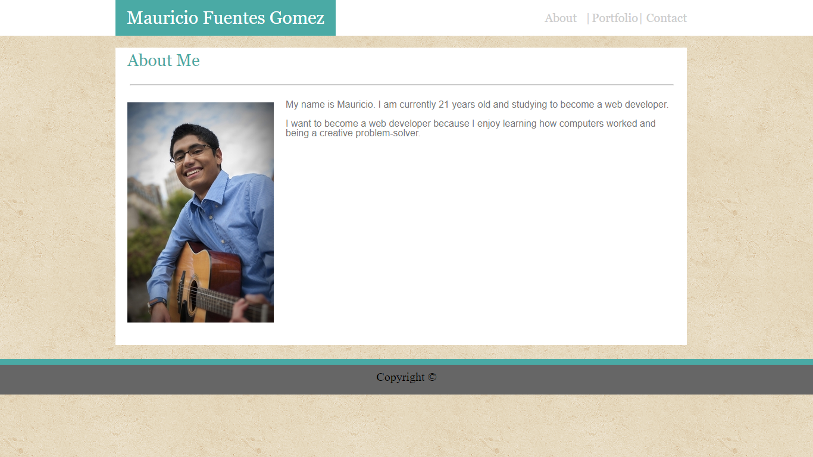
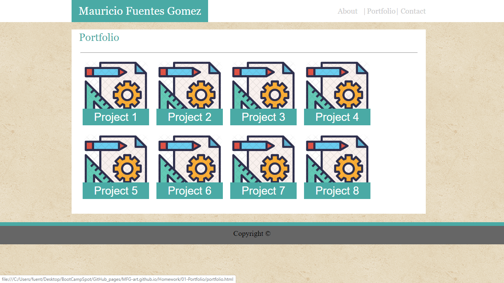
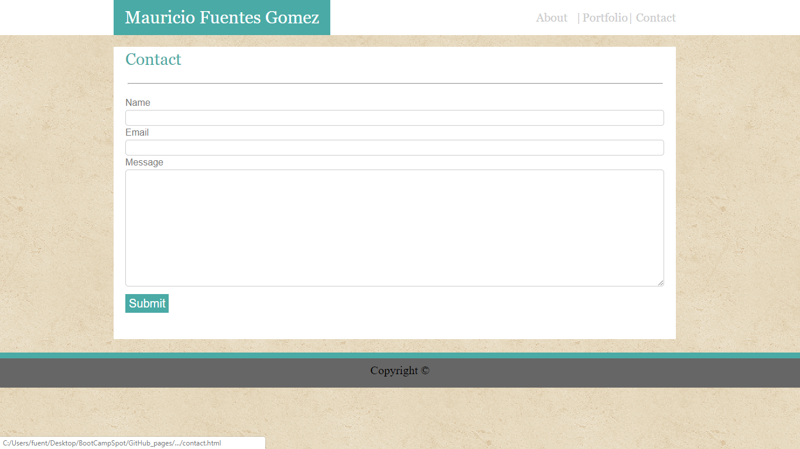

# MFG-art.github.io

## Table of Contents

- [Description](#description)
- [Usage](#usage)
- [Credits](#credits)
- [License](#license)

## Description

The purpose of this project is to display my abilities and projects for curious employers. By creating a digital portfolio, not only am I creating a unique and recognizable portfolio that makes me easily distinguishable from my peers, I am also providing my employers with a sample of what I am capable of.

This homework assignment provided its fair share of challenges. Although creating the wireframe for each page in HTML was easy, getting elements to align and display properly with CSS proved hard to do. While examining the demo images provided, I realized that all three pages feature the exact same header, footer, background image and main div. Instead of trying to style each page separately, I dedicated my time to creating a template page that I could copy and modify to create my actual pages.

Styling the header was challenging because it contains several elements placed horizontally. HTML elements have aligned themselves vertically, and I had to use the _float-left_ property to make my h1 and link elements align horizontally into my header. Next, I adjusted the margins on the link and link divider elements - elements that contain the pipe symbols used to divide my links in the header. All of my link and link divider elements are contained in a div called _headerBox_. I adjusted the margins on _headerBox_ to separate it from the h1 element containing my name.

**Notes from 10/31/2019:**
This was my first homework assignment, and looking back, I've spotted a lot of issues that I now know how to address. The CSS used displays things in a rather plain and blocky way. All of the HTML elements are contained in flat one-dimensional containers. The footer appears to hover mid-page when Fullscreen mode is entered. Instead of using flat, one-dimensional elements, I could use borders to make my shapes more rounded and add a sense of dimension. I could use a CDN like Bootstrap or Font Awesome to add other visually appealing elements to my page. I could use the position attribute to set the footer element at the bottom of the page, regardless of screen dimensions.

My "About Me" page ended up looking like this:

My "Projects" page ended up looking like this:

My "Contact" looks like this:

## Usage

To navigate, use the links in the navbar. The links will open a new tab.

## Credits

Most credit goes to me, Mauricio Fuentes Gomez.
Special thanks to my peers and T.As for help.

## License

CC0-1.0
