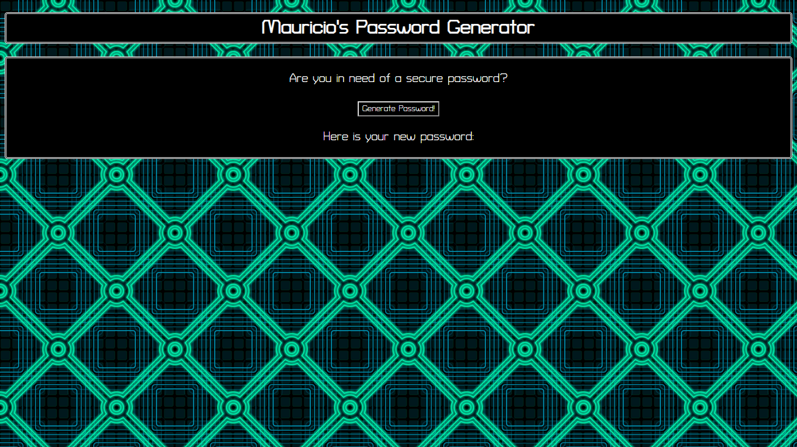
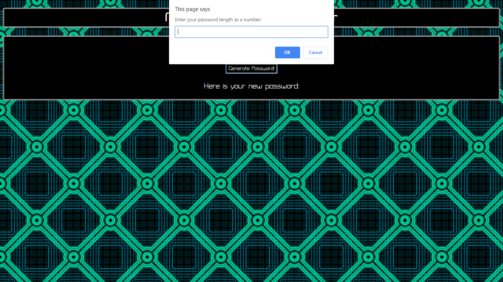
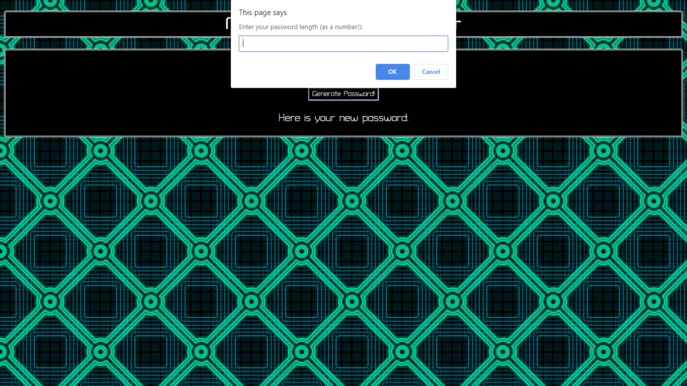
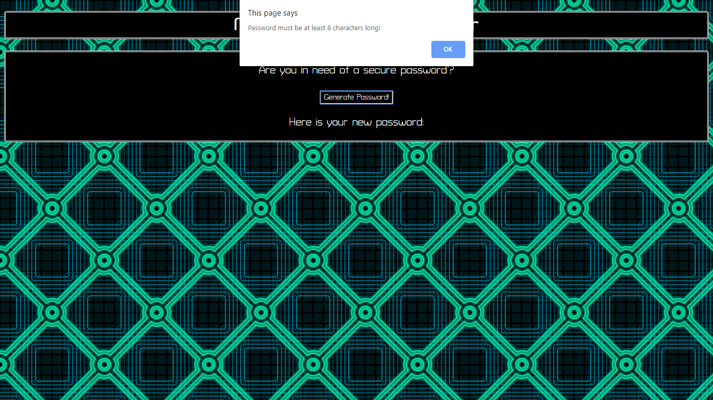
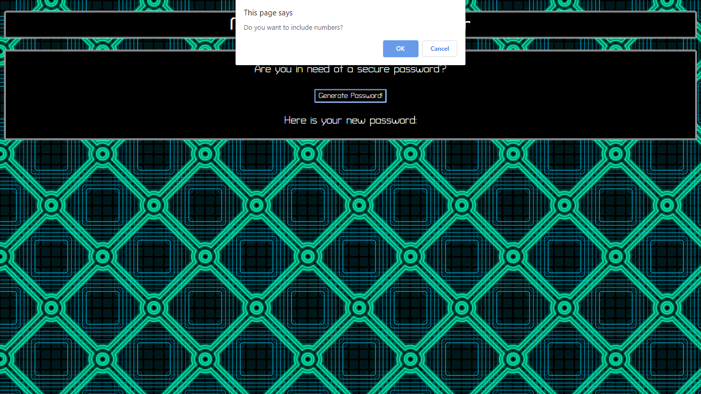
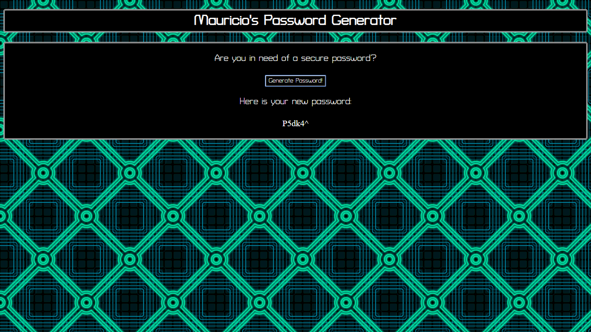

# Mauricio's Random Password Generator

## Table of Contents

- [Description](#description)
- [Usage](#usage)
- [Credits](#credits)

## Description

This project consists of a webpage that hosts a random password generator. The page contains a button for generating a password. Once this button is clicked, the user will be asked the desired length and characer content of their password, after which their password is displayed on the website.

This project consists of three main files: index.html, style.css, and script.js. Index.html provides the general layout and information about the DOM of the website. Style.css styles the text and background. Script.js is where the magic happens. It contains a prompt that will ask the user how long they want their generated password to be. There is a series of if/else statements that determine if the given input is a valid number. This is important because the prompt method returns a string and the 'for' loop that follows requires an integer. The given input must be able to be parsed cleanly into an integer.

There are four confirms afterwards, asking the user whether their new password should contain uppercase letters, lowercase letters, numbers, and/or special characters. Each of the selected character types are placed in an array as strings, saved for the logic that is to come.

Once all prompts and confirms have been answered, the code moves into a 'for' loop. The number of loop interations is equivalent to the password length specified by the user.

```javascript
while (passwordLength < 8 || passwordLength > 128) { ... }
```

For each iteration of the loop, a random number will be generated that creates a random index value that selects a character type from the previously mentioned array. The selected string is stored in a variable called 'randCharType'. A series of if and else if statements dependent on the value of randCharString determine what character type we have chosen at random.

Inside each if or else if statement, another random integer will be generated. This integer can be 0 and up to the length of the character array containing the specific character type selected. For example, for the 'if' statement that selects uppercase characters, this integer will be in the range of 0 - 25.

For generating uppercase characters, lowercase characters, and numbers, this project uses the 'String.fromCharCode()' method to convert integers into the character symbol associated with the ASCII character number. Since the values for uppercase characters, lowercase characters, and numbers are consecutive in ASCII, we can use an equation to generate an ascii value in their respective ranges.

```javascript
// 48 - 57 are numbers 0 - 9
var newChar = String.fromCharCode(Math.floor(Math.random() * 10) + 48);

// 64 - 90 are uppercase letters A - Z
var newChar = String.fromCharCode(Math.floor(Math.random() * 26) + 64);

// 97 - 122 are lowercase letters a - z
var newChar = String.fromCharCode(Math.floor(Math.random() * 26) + 97);
```

For the special characters, an array is used instead. The random number generated for this section of code is an index in the range of this array.

Each new character is appended to a string variable called "password", which later displayed by editing one of the HTML elements via the .innerHTML property.

## Usage

When you first load the website, you will be greeted by this page:



If you click the "Generate Password!" button, you will see this prompt. You should answer this prompt by entering a number that is not smaller than eight or greater than one hundred twenty eight.



If you do not enter a number value, you will recieve this prompt. Enter a number to dismiss this prompt.



If your number is too small, you will see this prompt. Enter a number that is bigger than 7 to dismiss this prompt.



If your number is too large, you will see this prompt. Enter a number that is less than 129 to dismiss this prompt.


Next, this confirm wil appear. Select 'OK' if you want your password to contain uppercase characters, otherwise select 'Cancel'.


Next, this confirm wil appear. Select 'OK' if you want your password to contain lowercase characters, otherwise select 'Cancel'.


Next, this confirm wil appear. Select 'OK' if you want your password to contain numbers, otherwise select 'Cancel'.



Next, this confirm wil appear. Select 'OK' if you want your password to contain special characters, otherwise select 'Cancel'.


Once you have answered all prompts/confirms, you will see your password displayed on the page.



## Credits

All credits go to Mauricio.
