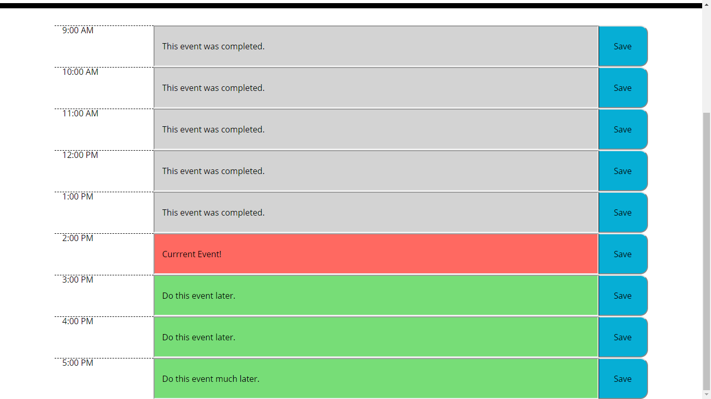

# Mauricio's Calendar

## Table of Contents
* [Description](#description)
* [Usage](#usage)
* [Credits](#credits)

## Description

This website contains a table of which each row represents an hour of a daily planner. The hours span from 9:00 AM to 5:00 PM. Each row lists the hour for that row, contains a text box for the user to write notes, and a save button. The daily planner is powered by moment.js, an API that accesses local time information from the user's device. Moment.js is called every time the page is loaded, and places the time information for the current time in a variable. The hour information is used to highlight the current hour on the planner as well as point out past and upcoming events. The text box of past events are given a gray background, the present hour is marked with a pink background, and the text boxes of future time slots are designated a pastel green background.

This screenshot was taken at 2:53 PM:



The user can enter descriptive text in each of the text boxes. In order for the text infomation of the text boxes to be saved in local storage, the user must click on the save button associated with that time slot. When the user does this, this calls a function that updates an array called *events* that stores the text information of each text box, which is stored in an object called *eventObject*. *eventObject* is converted into a JSON string and set locally. When the page is reloaded, it is first going to see if it stores an *eventObject* file locally. This is done by using a truthy/falsey statement.
```javascript
if (localStorage.getItem("eventObject") !== null) {
    console.log(localStorage.getItem("eventObject") !== null);
    var getObject = localStorage.getItem("eventObject");
    getObject = JSON.parse(getObject);
    events = getObject.events;
    console.log(getObject.events);
}
```
*localStorage.getItem()* will return **null** if it does not find a stored item with the provided key, so the above if statement will replace the contents of *events* with the locally stored data. If no *eventObject* item is found, it will default to an array with length 9 with each index containing a blank string (""). The contents of *events* are used to dispay

## Usage

To use, select a text box. These are either colored gray, pastel green, or pink. If you load the page outside of the 9:00 AM to 5:00 PM time range, they will all either be gray or green. Otherwise, the row representing the current hour will be marked pink. Enter your notes in the text box. 

**Make sure to always click the save button for each time slot after editing the text box inside it.**

The calendar is not deesigned to update it's time automatically. Reload the page to update it's time information.

To used

## Credits
Mauricio Fuentes Gomez - (main developer).
Moment.js is freely distributable under the terms of the MIT license.
Copyright 2019 The jQuery Foundation. JQuery is freely distributable under the terms of the MIT license.