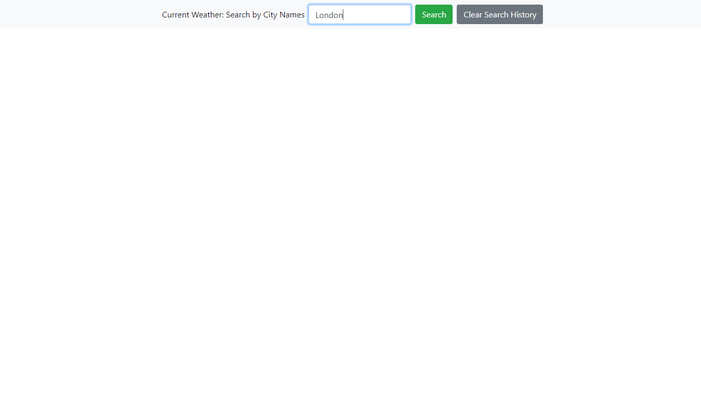

# [Weather Dashboard](https://mfg-art.github.io/Homework/06-Weather/)

Project link: [Weather Dashboard](https://mfg-art.github.io/Homework/06-Weather/)

## Table of Contents

- [Description](#description)
- [Usage](#usage)
- [Credits](#credits)
- [License](#license)

## Description

This application displays weather information based on user input.
The first action that will take place after the page has loaded is a search in your local storage for previous user inputs. If a JSON string with key _"pastSearchesJSON"_ is found, its content (an array containing user inputs as strings) will be parsed out and used to generate search buttons on the left side of the page. Clicking each button is equivalent to typing the name of that city in the search bar and hitting enter.

**_Clicking the "London" button is equivalent to typing "London" or "london" in the search bar and pressing enter_**

If a city already has a search button associated with it, another one will not be created. User inputs are formatted before use to prevent posssible repeated city buttons. For example, user inputs are all made lowercase, so that "London" and "london" don't create two separate buttons. The array containing past user inputs is scanned through with a for loop to ensure that incoming inputs aren't pushed to it if that same string already exists in it.

The user is prompted to enter a city name and submit their input by either pressing enter or clicking on the submit button. If their input does not contain a valid city name, the user will be prompted to enter a valid city name by an alert.

If a user input is valid, it will be trimmed and formatted so that it can be used as a parameter in an ajax call to _https://openweathermap.org_. This input is stored in a local variable and sent to a function which calls the OpenWeatherMap API. If the search has not been made before, a button will be created in the left side of the page that will retrigger the search.

The search results contain a five day forecast containing date, temperature, humidity, and weather information. Below this, current weather details are displayed. These details include the temperature in Fahrenheit, the humidity, a weather icon representing current weather conditions, wind speed in m/s and the UV index.

## Usage

This is what the page looks loaded without any past searches stored in local storage:

Before you submit your first search, the page will look like this:

Once you hit enter or click the green submit button, a new button will appear in the left column as well as your search results.

When other searches are made, they will append below the most recent search results.

To clear all search results, click on the gray "Clear Search Results" button.

Clicking on the gray city buttons provides updated weather information.

## Credits

This webpage was created by me, Mauricio Fuentes Gomez. Bootstrap is released under the MIT license and is copyright 2018 Twitter. Copyright 2019 The jQuery Foundation. jQuery License. Free weather API is provided under the terms of the Creative Commons Attribution-ShareAlike 4.0 Generic License.

## License

MIT License
